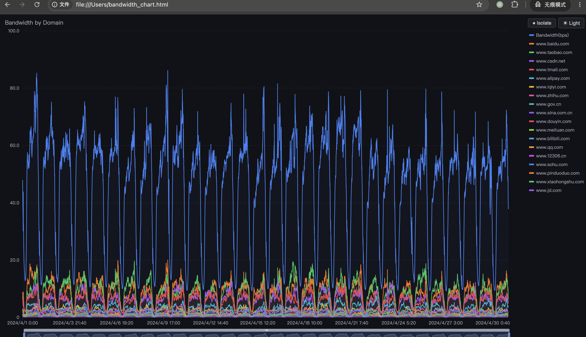
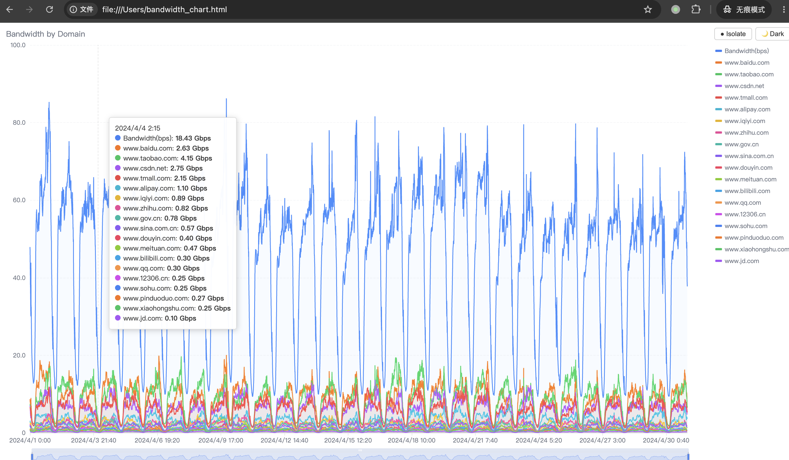

# splitbandwidth

将 CSV 中的汇总带宽按域名随机拆分为多条独立带宽曲线，同时生成可交互的离线 HTML 图表。

Split total bandwidth in a CSV file into random per-domain bandwidth curves, with an interactive offline HTML chart.

## Screenshot / 效果展示

> 打开 `examples/split_result.html` 即可在浏览器中查看完整交互效果。




**图表特性 / Chart Features:**
- 🌗 深色/浅色主题切换 (Dark/Light theme toggle)
- 🔍 Isolate 模式：单击图例多选独显 (Click legend to multi-select & isolate)
- 🚫 Hide 模式：单击图例隐藏指定线 (Click legend to hide lines)
- 📊 时间轴缩放 (Time-axis zoom with slider & mouse wheel)
- 📐 Y 轴自动换算单位 (Auto unit: bps → Kbps → Mbps → Gbps → Tbps, 1000-based)
- 📡 完全离线，无需网络 (Fully offline, no network needed)

## Install / 安装

### Download Binary / 下载可执行文件

从 [Releases](https://github.com/stanhui/splitbandwidth/releases) 下载对应平台的可执行文件：

| Platform | File |
|----------|------|
| Linux x86_64 | `splitbandwidth_linux_amd64` |
| Linux ARM64 | `splitbandwidth_linux_arm64` |
| macOS Intel | `splitbandwidth_darwin_amd64` |
| macOS Apple Silicon | `splitbandwidth_darwin_arm64` |
| Windows x86_64 | `splitbandwidth_windows_amd64.exe` |

### Build from Source / 从源码编译

```bash
go install github.com/stanhui/splitbandwidth@latest
```

Or:

```bash
git clone https://github.com/stanhui/splitbandwidth.git
cd splitbandwidth
go build -o splitbandwidth .
```

## Usage / 用法

```bash
splitbandwidth <source.csv> <domains.txt> [flags]
```

### Examples / 示例

```bash
# 输出单文件 CSV + 图表
splitbandwidth traffic.csv domains.txt -o result.csv

# 指定随机种子和小数位数
splitbandwidth traffic.csv domains.txt -o result.csv --seed 42 --decimal-places 2

# 输出多文件（每个域名一个 CSV）
splitbandwidth traffic.csv domains.txt --output-dir split_output

# 不生成图表
splitbandwidth traffic.csv domains.txt -o result.csv --no-chart
```

### Flags / 参数

| Flag | Default | Description |
|------|---------|-------------|
| `-o`, `--output-file` | | 单文件输出路径 / Single output CSV path |
| `--output-dir` | `split_output` | 多文件输出目录 / Multi-file output directory |
| `--chart-file` | | HTML 图表路径 / HTML chart output path |
| `--no-chart` | `false` | 不生成图表 / Skip chart generation |
| `--bandwidth-col` | `B` | 带宽列（列名、列号或字母）/ Bandwidth column |
| `--seed` | random | 随机种子 / Random seed |
| `--decimal-places` | `0` | 输出小数位数 / Decimal places |
| `--mode` | `profile` | 拆分模式: `profile` or `independent` |
| `--domain-spread` | `1.2` | 域名间差距（仅 profile）/ Domain spread |
| `--volatility` | `0.18` | 时间波动（仅 profile）/ Time volatility |
| `--smoothness` | `0.98` | 曲线平滑度（仅 profile，< 1）/ Smoothness |

### Input Format / 输入格式

**source.csv** — 第一行为表头，需包含时间列和带宽列（默认第 B 列）：

```csv
Time,Bandwidth(bps)
2025-01-01 00:00:00,1000000000
2025-01-01 00:05:00,1200000000
```

**domains.txt** — 域名列表，空白/逗号/分号分隔：

```
cdn1.example.com
cdn2.example.com
cdn3.example.com
```

## Release / 发布

打 tag 后 GitHub Actions 自动编译并发布所有平台的可执行文件：

```bash
git tag v1.0.0
git push origin v1.0.0
```

## License

MIT
